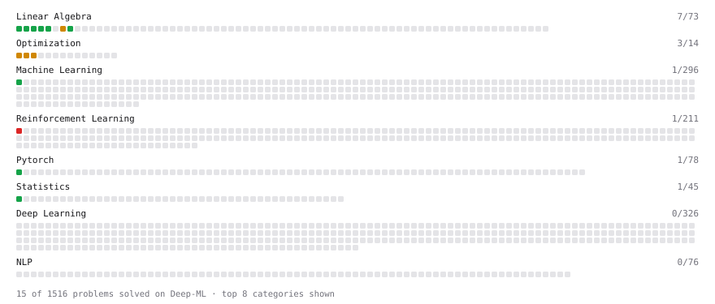

# Deep-ML

My machine learning practice from [Deep-ML](https://www.deep-ml.com). Every solution here was written by hand.

**13** solved · 13 problems · 0 labs · 0 math

[**Browse the interactive portfolio**](https://hengyu0510.github.io/deep-ml/) to replay this filling in over time.

## Problems

| | Difficulty | Solved | |
| --- | --- | --- | --- |
| [Calculate 2x2 Matrix Inverse](https://www.deep-ml.com/problems/8) | easy | 2026-10-09 | [solution](problems/0008-calculate-2x2-matrix-inverse) |
| [Calculate Covariance Matrix](https://www.deep-ml.com/problems/10) | easy | 2026-10-09 | [solution](problems/0010-calculate-covariance-matrix) |
| [Calculate Mean by Row or Column](https://www.deep-ml.com/problems/4) | easy | 2026-10-09 | [solution](problems/0004-calculate-mean-by-row-or-column) |
| [Derivative of a Polynomial](https://www.deep-ml.com/problems/116) | easy | 2026-10-10 | [solution](problems/0116-derivative-of-a-polynomial) |
| [Linear Regression Using Normal Equation](https://www.deep-ml.com/problems/14) | easy | 2026-10-09 | [solution](problems/0014-linear-regression-using-normal-equation) |
| [Matrix-Vector Dot Product](https://www.deep-ml.com/problems/1) | easy | 2026-10-09 | [solution](problems/0001-matrix-vector-dot-product) |
| [Reshape Matrix](https://www.deep-ml.com/problems/3) | easy | 2026-10-09 | [solution](problems/0003-reshape-matrix) |
| [Scalar Multiplication of a Matrix](https://www.deep-ml.com/problems/5) | easy | 2026-10-09 | [solution](problems/0005-scalar-multiplication-of-a-matrix) |
| [Transpose of a Matrix](https://www.deep-ml.com/problems/2) | easy | 2026-10-09 | [solution](problems/0002-transpose-of-a-matrix) |
| [Implement AdamW Optimizer Step](https://www.deep-ml.com/problems/169) | medium | 2026-10-10 | [solution](problems/0169-implement-adamw-optimizer-step) |
| [Matrix Transformation ](https://www.deep-ml.com/problems/7) | medium | 2026-10-09 | [solution](problems/0007-matrix-transformation) |
| [Muon Optimizer Step with Matrix Preconditioning](https://www.deep-ml.com/problems/170) | medium | 2026-10-10 | [solution](problems/0170-muon-optimizer-step-with-matrix-preconditioning) |
| [Warmup + Cosine Decay Schedule](https://www.deep-ml.com/problems/196) | medium | 2026-10-10 | [solution](problems/0196-warmup-cosine-decay-schedule) |

---

_This file is regenerated by Deep-ML on every push._
